# this talk won't help you steal

## (but it may be fun)

---

# [fit] my first lock

^
• owning a lockpicking kit is illegal in the netherlands

---

---

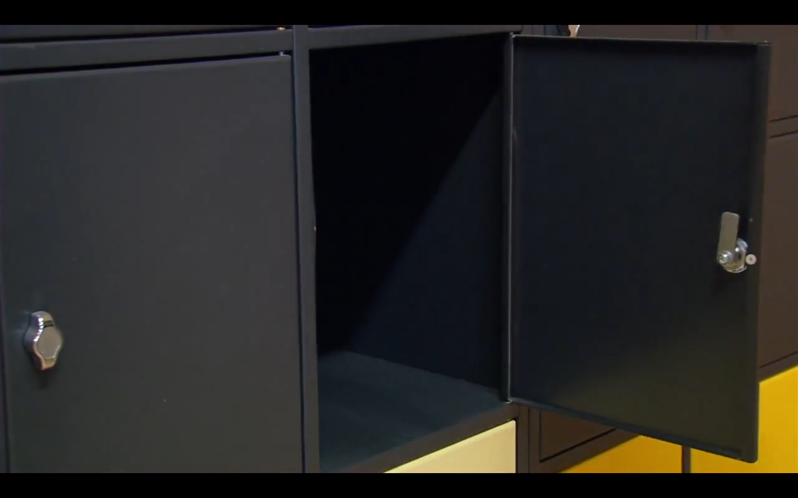

---

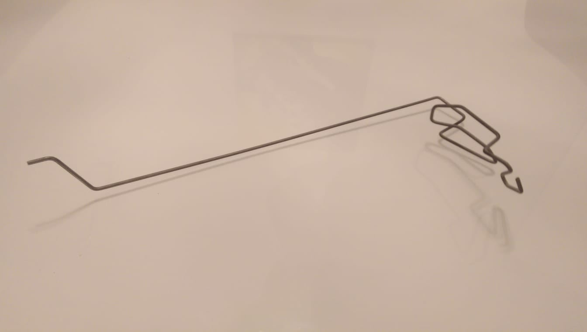

---

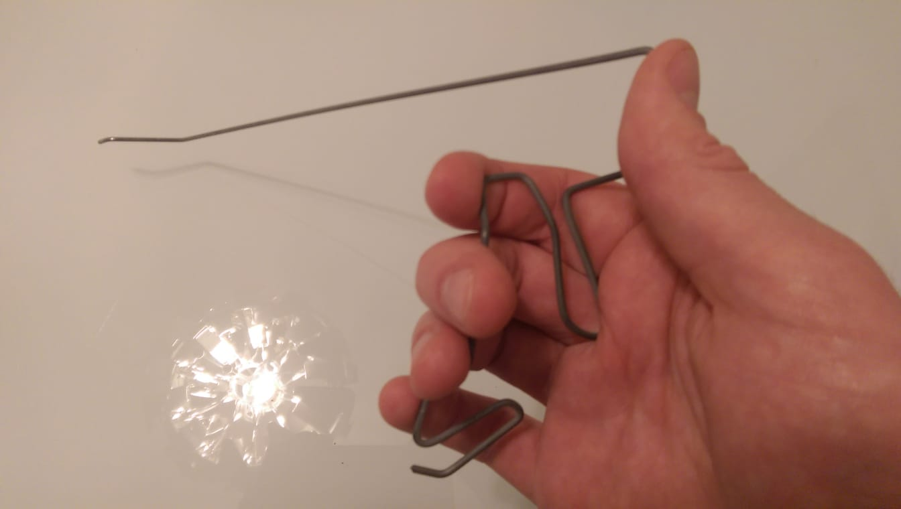

---

# [fit] <insert triumphant photo here>

---

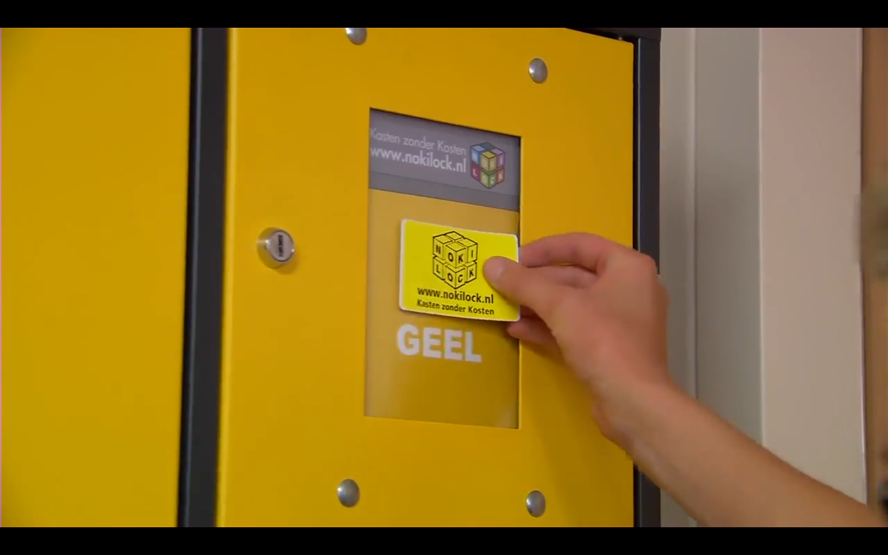

---

# 🤷🏻‍♀️

---

# why won't this help me steal?

---

<!-- https://www.youtube.com/watch?v=TFqTh8NTIqY -->
<!-- Student Housing Center in Bryan, Texas      -->

^
• bathroom lock broke
• crowbar & 10 seconds to open

---

<!-- https://www.youtube.com/watch?v=FqhhXyROxQM -->

^
• some European locks
• lock snapping
• literally break the lock in half

---

<!-- https://www.youtube.com/watch?v=rDlZbQ20aLI -->

^
• bump key & electric toothbrush
• for some reason

---

# so how does it work?

---

# tumbler locks

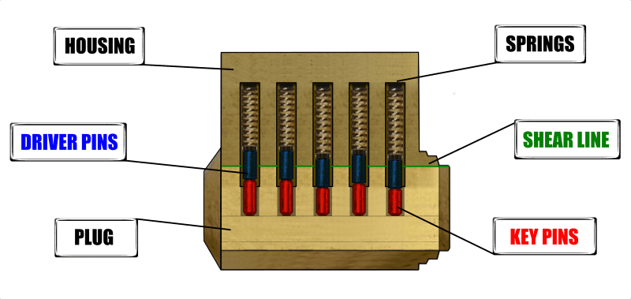

^
• first tumbler locks
• most common lock

---

---

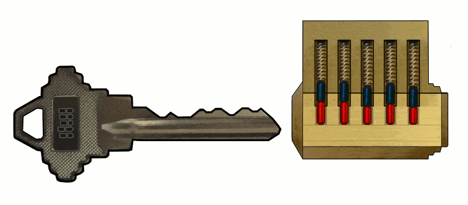

---

# what if i don't have a key?

## (tools of the trade)

---

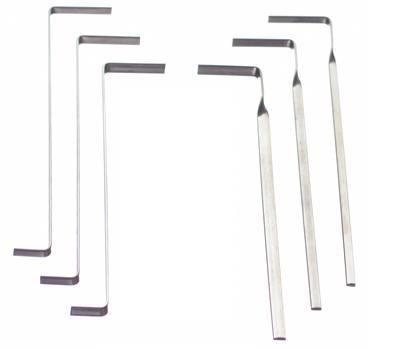

# tension wrench

---

# hook

---

# what if i don't have a key?

## (no lock is perfect)

---

# perfect plug

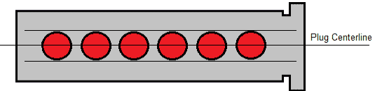

# real plug

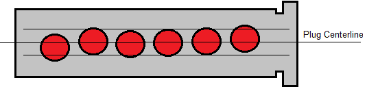

^
• lock picking is only possible because of manufacturing errors
• a perfect lock is unpickable
• if you apply tension, the plug will catch on the pin furthest away from the centerline

---

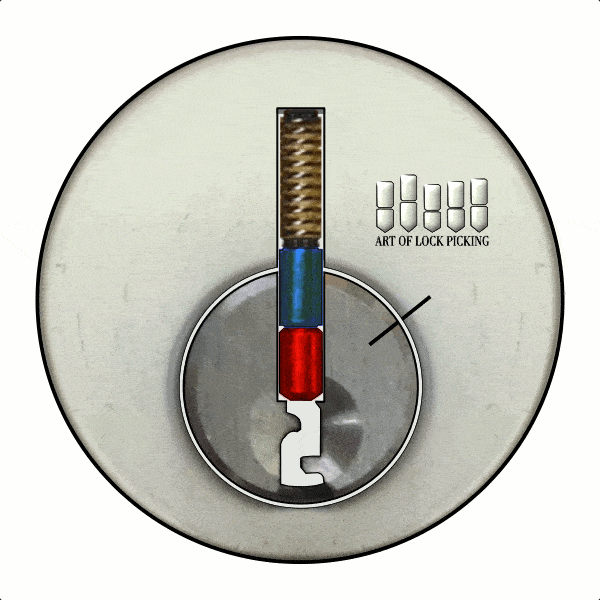

---

---

# [fit] demo?

---

# what if i don't have a key?

## (but i'm laaazyyyy!)

---

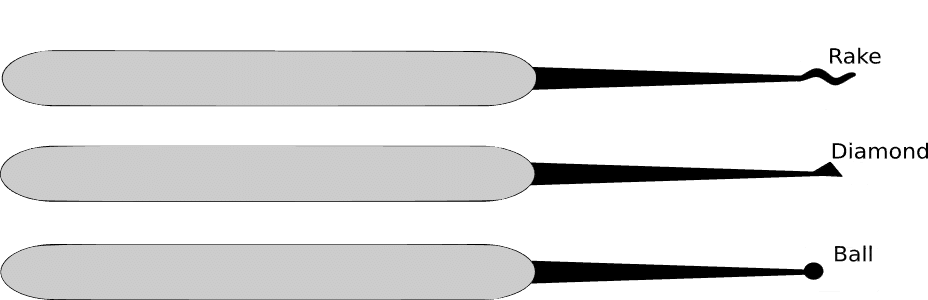

---

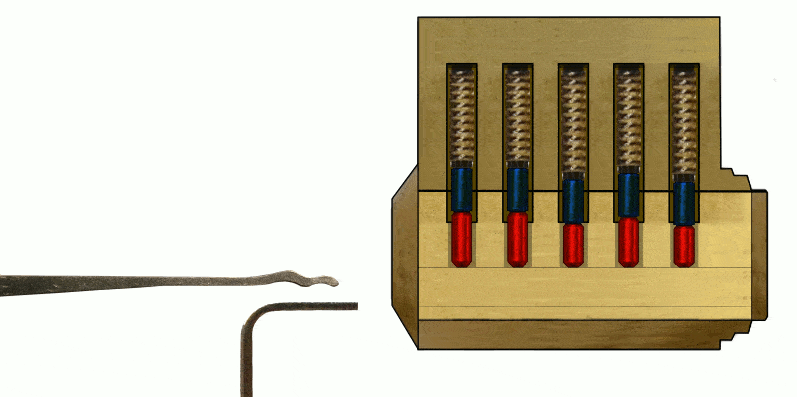

---

# [fit] demo?

---

## reminder: having secure locks is really kinda nice actually

---

# security pins

<!-- https://www.youtube.com/watch?v=KB7wv-JPHXY -->
<!-- https://www.youtube.com/watch?v=KB7wv-JPHXY -->
<!-- https://www.youtube.com/watch?v=KB7wv-JPHXY -->

[.header: #FFFFFF]
[.background-color: #000000]

---

# any other kinds of locks?

---

# wafer locks

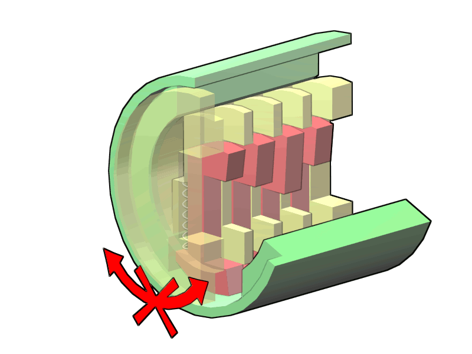
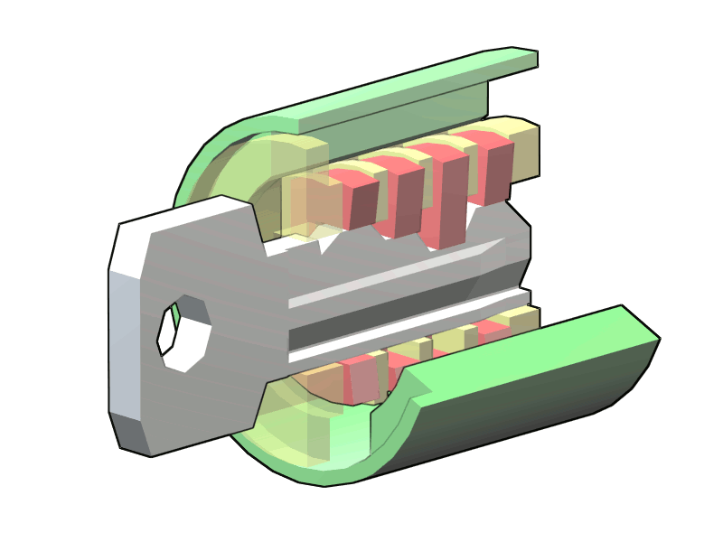

---

^ 
• similar to tumbler locks
• lower standards for tolerances
• easier to pick
• wafers are one piece
• wafers move up and down 
• cannot be bumped

---

# try-out keys

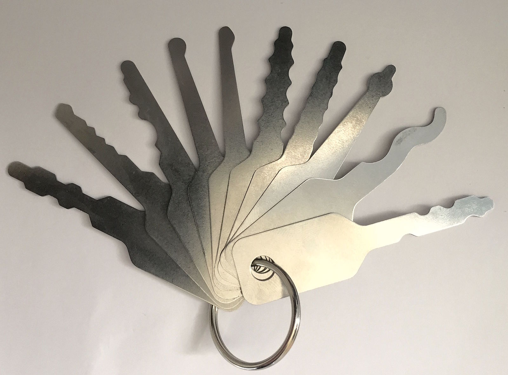

^
• insert & sorta jiggle them around
• possible due to low tolerances
• example: set of 64 try-out keys opens almost all General Motors cars before 1967
• only need to be close enough

<!-- http://www.aerolock.com/general-motors.html -->

---

# tubular locks

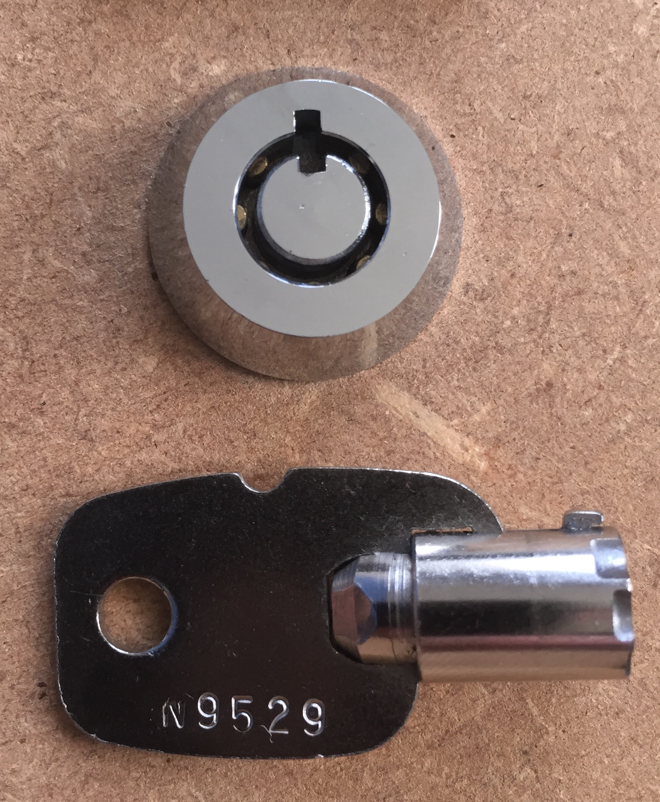

---

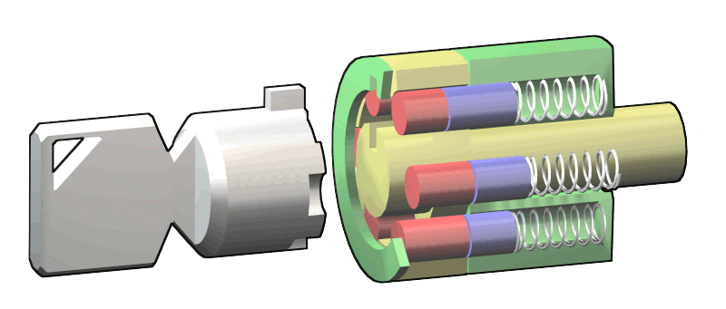
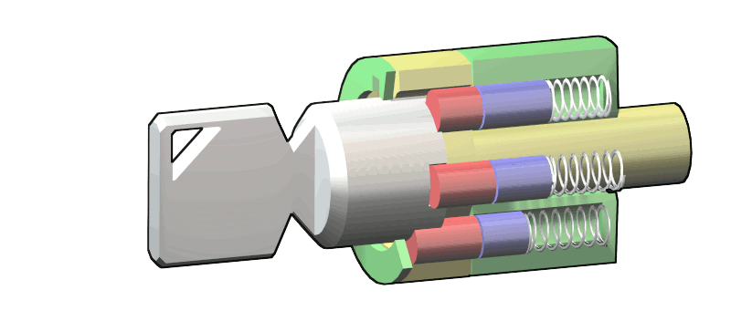

^
• similar to tumbler locks
• can be single pin picked
• access is more difficult
• especially tension
• cannot be bumped

---

^
• awesome tools like this
• adjustable pins
• get them all right
• you'll have a key

<!-- https://www.youtube.com/watch?v=eNXhKwiO1OA -->

---

# disc tumbler locks

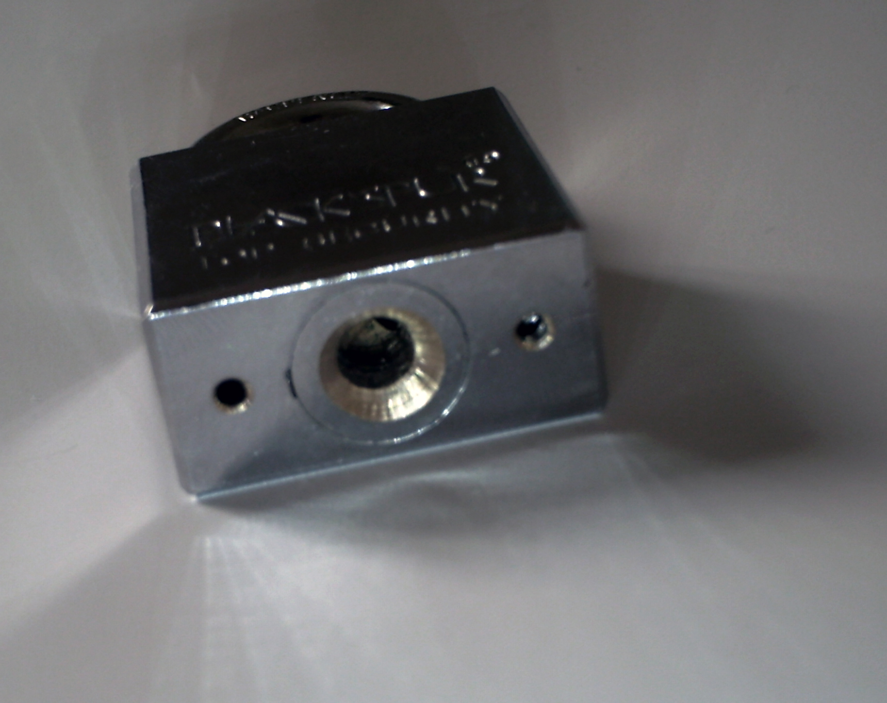

---

<!-- https://www.youtube.com/watch?v=wnW5GgaDKFc -->

---

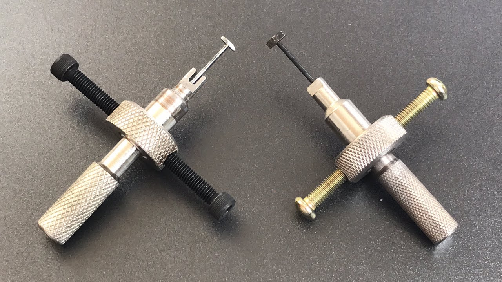

---

<!-- https://www.youtube.com/watch?v=rdcDhmifEgo -->

---

# magnetic keyed locks

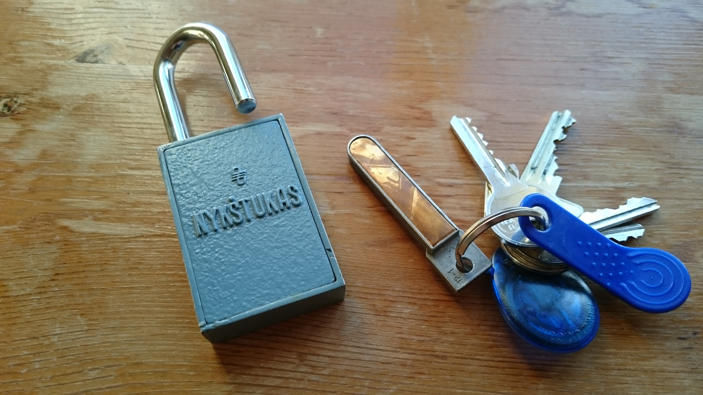

^
• absolutely insane
• works like a tumbler lock
• no physical access to pins
• pins are pushed into place by a strip with varying magnetic force

---

^
• absolutely insane
• picking with a magnet
• this lock is 20+ years old
• some locks remain unpicked

<!-- https://www.youtube.com/watch?v=pWuomCDWWV0 -->

---

# [fit] ok bye now :wave:

---

## if you want to try it for yourself, stick around after pizza!
